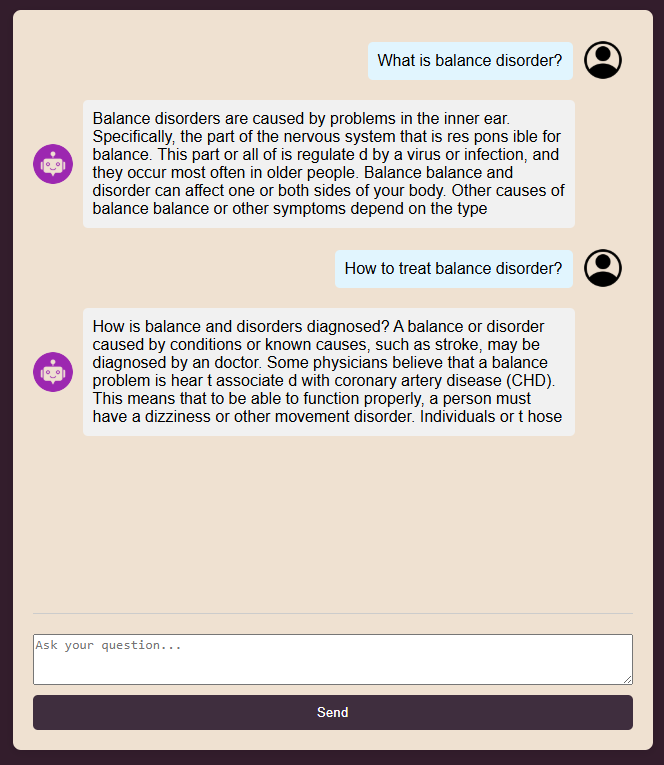

 
# Overview

This is an overview of the "Medical Chatbot with UI," a personal project aimed at self-learning and practicing with large language models (LLM).

## Introducttion

This project demonstrates a generative medical chatbot that provides real-time responses to medical queries using Large Language Models (LLMs), specifically GPT-2. The chatbot leverages the Comprehensive Medical Q&A Dataset from Kaggle and is fine-tuned with this dataset to offer intelligent and contextually appropriate medical advice. The chatbot interface is built using Flask, providing a user-friendly platform for seamless real-time interaction.

The system aims to showcase the capabilities of LLMs in the medical domain, bridging the gap between advanced natural language processing (NLP) technologies and healthcare applications. While it demonstrates the potential of generative AI in healthcare, it also highlights the challenges associated with deploying AI models for sensitive domains, especially when limited resources are available.



## Key Features

**Real-Time Interaction:** Utilizing Flask, this chatbot enables users to engage in real-time conversations with the AI. The conversational flow is designed to be smooth, and responses are generated instantly by the underlying LLM.

**Trained GPT-2 model:** At the core of the chatbot is GPT-2, a pre-trained LLM developed by OpenAI, which has been fine-tuned on a medical-specific dataset to enhance its ability to answer health-related queries. GPT-2 excels in generating human-like, context-aware responses based on the input it receives.

**Fine-Tuned LLM on Medical Data:** The chatbot is trained using the Comprehensive Medical Q&A Dataset, a dataset containing thousands of medical questions and answers. This allows the LLM to learn the language patterns and nuances specific to healthcare, making it more capable of addressing common medical inquiries.

**Flask Web Interface:** The user interface is built using Flask, which serves as a lightweight framework for hosting and deploying the chatbot. The web interface is responsive, allowing users to chat with the AI seamlessly from any browser.

**Generative AI:** This project demonstrates the power of generative AI in the medical domain. By leveraging the capabilities of LLMs, the chatbot is able to generate responses that mimic natural human conversation, providing users with a more interactive and engaging experience.

## Limitations

**Performance Inconsistencies:** Given the computationally intensive nature of fine-tuning and running LLMs like GPT-2, performance may vary depending on system resources. Users may experience slower response times or inaccurate answers in cases where resources are limited.

**Accuracy Constraints:** Its outputs may not always be medically accurate. The model is trained on a small fixed dataset and does not have real-time access to updated medical knowledge, which limits its ability to provide the most current or precise medical advice.

**Generalized Medical Knowledge:** The model’s training is based on a broad medical dataset and does not specialize in any particular field of medicine. Users seeking highly specialized medical advice are advised to consult with a qualified healthcare professional.

## How to Use

1. Clone the Repository to your local machine.

2. Install the necessary dependencies by running:
```
pip install -r requirements.txt
```
3. Run the Application by running
```
python app.py
```
4. Open your browser and navigate to http://127.0.0.1:80/ to begin chatting with the AI.

## Technologies Used

**Python:** The primary programming language used for the backend development of the chatbot.

**GPT-2 (Large Language Model):** The pretrained AI model used, fine-tuned with medical-specific data to generate relevant, conversational responses.

**Flask:** The web framework used to create the real-time chatbot interface and manage user interactions.

## Dataset

**Kaggle Dataset:** The Comprehensive Medical Q&A Dataset

https://www.kaggle.com/datasets/thedevastator/comprehensive-medical-q-a-dataset

## How It Fits Into Generative AI

This project is part of the growing field of Generative AI, where models like GPT-2 are trained on vast amounts of text data to generate human-like responses to a variety of inputs. In this case, the model is specifically fine-tuned on medical data to cater to health-related queries, demonstrating how LLMs can be applied to specialized domains like healthcare.

By utilizing a Generative Pretrained Transformer (GPT) model, this project explores how LLMs can revolutionize industries like healthcare by providing AI-powered assistance in areas such as customer support, initial diagnosis, and informational guidance.

## Future Improvements

Performance Optimization: Optimizing the model to work with lower computational resources or using more efficient model variants could improve performance and scalability.

Expanded Medical Knowledge: Incorporating additional datasets, including more specialized medical fields, could enhance the chatbot’s ability to answer more specific health-related questions.

Specialized Fine-Tuning: Fine-tuning the model on niche medical topics or subfields could improve the quality of responses for those areas, making the chatbot more useful for targeted medical advice.

## Disclaimer

This chatbot is for learning purposes only and should not be considered a substitute for professional medical advice. Always consult with a healthcare provider for any medical concerns or before making healthcare decisions.

##### Topic Full Name

- Medical Chatbot with UI

##### Member
- NG Chun Fung (https://github.com/cfngai)